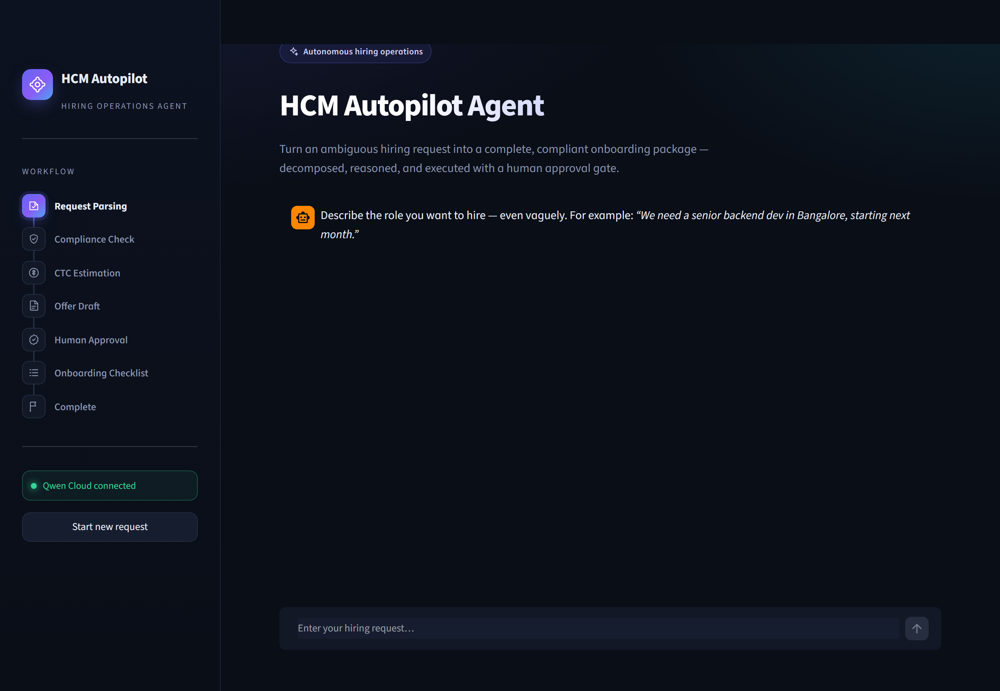
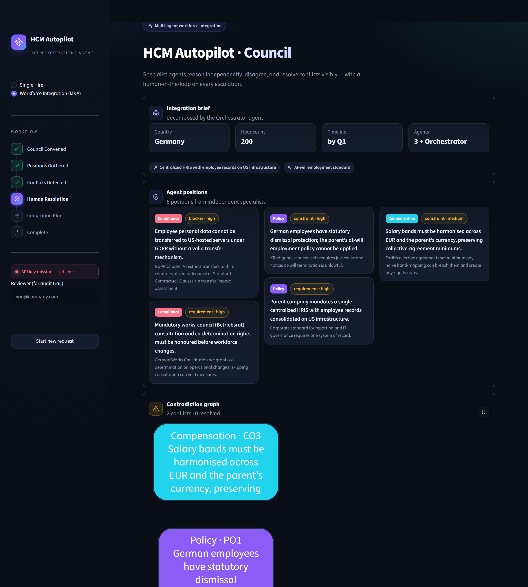

# HCM Autopilot Agent

An enterprise **Human Capital Management (HCM)** autopilot that turns an
ambiguous, natural-language hiring request into a complete, compliant
**onboarding package** — autonomously decomposing the work, orchestrating
execution through **Qwen Cloud function calling**, running a **multi-agent
compliance critic**, and pausing for **human approval** before finalizing.

This is a production-oriented workflow-automation agent, not a chatbot. The
model reasons about what's missing, asks for clarification when the input is
ambiguous, runs a multi-step tool pipeline, self-reviews for compliance
violations, and stops for a human before the offer is committed.

> **Track 4 — Autopilot Agent.** Handles ambiguous inputs, invokes external
> tools, and enforces a human-in-the-loop checkpoint at the critical decision.

It runs in two modes:
- **Single Hire** — the end-to-end hiring → onboarding pipeline.
- **Workforce Integration (M&A)** — a **multi-agent council** where specialist
  agents (Policy, Compensation, Compliance) reason independently, **disagree**,
  and the Orchestrator surfaces each conflict — with both positions, a risk
  assessment, and resolution options — to a human. *"We're acquiring a 200-person
  company in Germany. Integrate their workforce by Q1."*





---

## Highlights

- **Sophisticated Qwen Cloud usage** — native function calling with parallel
  tool calls, **structured `json_object` output** (Pydantic-validated), token
  **streaming with usage**, **`text-embedding-v4`** for RAG, and `qwen-vl-max`
  for multimodal JD parsing. All via the OpenAI SDK against DashScope.
- **Multi-agent council with visible conflict resolution** — for macro tasks,
  Policy / Compensation / Compliance agents run **in parallel**, produce
  positions, and a **contradiction graph** detects where they clash (e.g. GDPR
  data-transfer block vs a centralized US HRIS mandate). The Orchestrator
  escalates each conflict to a human with both sides, risk, and options.
- **Compliance-Critic** — an independent reviewer agent (its own Qwen call +
  deterministic guardrails) audits the offer against statutory facts and the CTC
  band, and can **force an automatic revision** before the human gate.
- **Genuine human-in-the-loop** — a first-class tool that pauses the workflow,
  threaded on the `tool_call_id`, with reviewer identity captured to an audit trail.
- **RAG-augmented knowledge** — a `VectorStore` over the compliance KB (Qwen
  embeddings, offline keyword fallback) fills gaps for geographies beyond the
  hardcoded set.
- **Production-readiness** — per-call token/cost/latency **observability**, an
  append-only **SQLite audit trail**, **Alibaba Cloud OSS** export, graceful
  degradation everywhere, Docker/compose, CI, and 28 tests.

---

## What it does

Given something as vague as *"We need a senior backend dev in Bangalore, starting
next month,"* the agent:

1. **Parses** the request into structured fields (JSON mode), resolving relative
   dates and flagging missing critical info (asks if role/location are unclear).
2. **Checks geo-compliance** — notice periods, probation, benefits, documents,
   statutory filings, risk flags (RAG-augmented for unknown geographies).
3. **Estimates the CTC band** for the role, level and location.
4. **Drafts an offer letter** with all key terms filled in.
5. **Runs the Compliance-Critic** — flags out-of-band CTC or unmet pre-start
   statutory requirements and auto-revises before proceeding.
6. **Pauses for human approval** — shows a summary; never auto-approves.
7. On approval, **generates a sequenced onboarding checklist + timeline**.
8. **Exports** the full package as JSON/Markdown and (optionally) to Alibaba
   Cloud OSS; every decision is written to the audit trail.

Reject at the gate with a note like *"cap CTC at 30L"* and the agent re-runs the
affected tools and re-presents the checkpoint.

---

## Architecture

Full Mermaid diagram and design rationale: **[docs/architecture.md](docs/architecture.md)**.

```
User (Streamlit UI)
      │  request / clarifications / approval
      ▼
Orchestrator Agent  ──►  Qwen Cloud API (qwen-plus · qwen-turbo · text-embedding-v4 · qwen-vl-max)
      │
      ├─ parse_hiring_request        (LLM + structured output)
      ├─ check_geo_compliance        (knowledge base + RAG)
      ├─ estimate_ctc_band           (knowledge base)
      ├─ generate_offer_letter       (template)
      ├─ review_compliance           ◆ Compliance-Critic sub-agent (can force revision)
      ├─ flag_for_approval           ⛔ HUMAN-IN-THE-LOOP
      └─ create_onboarding_checklist (deterministic)
                    │
                    ▼
   Onboarding Package → download · Alibaba Cloud OSS · SQLite audit trail
```

All LLM reasoning flows through the OpenAI SDK pointed at Qwen Cloud (DashScope,
Alibaba Cloud Model Studio):

```python
from openai import OpenAI
client = OpenAI(
    api_key=os.getenv("QWEN_CLOUD_API_KEY"),
    base_url="https://dashscope-intl.aliyuncs.com/compatible-mode/v1",
)
```

---

## Setup & run

**Prerequisites:** Python 3.11+ and a Qwen Cloud (DashScope international) API key.

```bash
python -m venv .venv && source .venv/bin/activate   # Windows: .venv\Scripts\activate
pip install -r requirements.txt
cp .env.example .env          # then set QWEN_CLOUD_API_KEY in .env
streamlit run app.py          # opens http://localhost:8501
```

**Offline dev:** point `.env` at a local Ollama Qwen-Coder model instead
(`QWEN_BASE_URL=http://localhost:11434/v1`, `QWEN_PRIMARY_MODEL=qwen2.5-coder:7b`).
The demo should be recorded on Qwen Cloud (`qwen-plus`) for reliable tool calling.

---

## Deployment (Alibaba Cloud ECS)

Full guide: **[docs/DEPLOYMENT.md](docs/DEPLOYMENT.md)**.

```bash
docker compose up --build          # or: docker build -t hcm-autopilot . && docker run -p 8501:8501 --env-file .env hcm-autopilot
```

Deploy the container on an ECS instance, open inbound TCP 8501 in the security
group, and browse to `http://<ecs-public-ip>:8501`.

### Proof of Alibaba Cloud usage
- **[src/utils/qwen_client.py](src/utils/qwen_client.py)** — all reasoning,
  embeddings and vision call **DashScope (Alibaba Cloud Model Studio)**.
- **[src/utils/oss_client.py](src/utils/oss_client.py)** — publishes packages to
  **Alibaba Cloud OSS** via the `oss2` SDK.

---

## Tests & CI

```bash
pytest -q      # 28 tests
```

Covers the compliance KB, deterministic tools, the orchestrator's full control
flow (HITL pause, revise/re-run), the Compliance-Critic, and the RAG retriever —
Qwen client mocked so the suite runs offline. GitHub Actions runs it on every push.

---

## Configuration notes
- **No hardcoded secrets.** Keys read only from env via `python-dotenv`; `.env`
  is git-ignored, `.env.example` documents every var.
- **Graceful degradation** — OSS, embeddings, and vision are optional; the app
  runs fully without them (RAG falls back to keyword search).
- **State** lives in Streamlit session state; the audit trail persists to SQLite.

---

## Project structure

```
app.py                       Streamlit UI (streaming, timeline, metrics, HITL, OSS, audit)
src/agent/orchestrator.py    Agent loop + Qwen function calling (resumable)
src/agent/critic.py          Compliance-Critic sub-agent
src/tools/                   parse, compliance, ctc, offer, onboarding, approval, vision
src/knowledge/               compliance_data, salary_bands, retriever (RAG)
src/utils/                   qwen_client, oss_client, audit
src/ui/theme.py              dark-enterprise theme + inline SVG icon set
tests/                       pytest suite (28 tests)
docs/                        architecture.md, DEPLOYMENT.md, DEMO_SCRIPT.md
plans/winning-plan.md        phased roadmap
```

---

## License

Released under the [MIT License](LICENSE).
