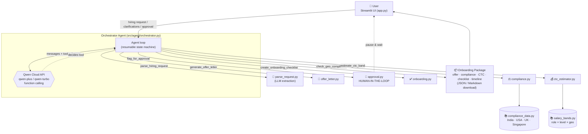

# HCM Autopilot Agent — Architecture

The HCM Autopilot is an enterprise workflow-automation agent. It ingests an
ambiguous natural-language hiring request, autonomously decomposes it into a
sequenced pipeline, executes that pipeline through **Qwen Cloud function
calling**, enforces a **human-in-the-loop approval gate**, and emits a complete
onboarding package. It is not a chatbot — the LLM is the *reasoning engine* that
decides which tool to call next; the deterministic tools do the domain work.

## System components & data flow



## Pipeline phases

| # | Phase                 | Tool                          | Nature            |
|---|-----------------------|-------------------------------|-------------------|
| 1 | Request Parsing       | `parse_hiring_request`        | LLM extraction    |
| 2 | Compliance Check      | `check_geo_compliance`        | Knowledge base    |
| 3 | CTC Estimation        | `estimate_ctc_band`           | Knowledge base    |
| 4 | Offer Draft           | `generate_offer_letter`       | Template fill     |
| 5 | **Human Approval**    | `flag_for_approval`           | **HITL pause**    |
| 6 | Onboarding Checklist  | `create_onboarding_checklist` | Deterministic     |
| 7 | Complete              | —                             | Package export    |

## Key design decisions

### 1. Qwen Cloud as the reasoning engine
Every reasoning/decomposition call goes through the OpenAI SDK pointed at
`https://dashscope-intl.aliyuncs.com/compatible-mode/v1` (`src/utils/qwen_client.py`).
The model is handed six tool schemas and chooses the next action via
`tool_choice="auto"`. `qwen-plus` is primary; `qwen-turbo` is an automatic
fallback on transient errors.

### 2. Resumable orchestrator (Streamlit-friendly)
Streamlit re-runs the whole script on each interaction, and the workflow must
pause for a human. The orchestrator is therefore a **resumable state machine**,
not a blocking loop. `_run()` executes tool calls until it either finishes, asks
a clarifying question, or hits the approval gate — then returns control. The
full conversation (`messages`) plus collected artifacts live in Streamlit
session state, so `submit_clarification()` / `submit_approval()` resume exactly
where the agent paused.

### 3. Human-in-the-loop is a real tool, not just UI
`flag_for_approval` is a first-class function the model must call. When invoked,
the orchestrator appends the tool result but **does not call the model again** —
it records the pending `tool_call_id`, sets status `AWAITING_APPROVAL`, and
returns. Only when the user clicks **Approve** (or **Revise** with notes) does
the orchestrator inject the human's decision as the tool result and resume. This
makes the pause point part of the agent's function-calling trace.

### 4. Deterministic domain tools over hardcoded knowledge bases
Compliance and salary data are self-contained Python knowledge bases — no
external API calls — so results are stable, testable, and offline-runnable. Only
`parse_hiring_request` calls the LLM (turning free text into structured fields);
everything else is deterministic and unit-tested.

### 5. Revision loop
Rejecting at the gate with a note (e.g. *"cap CTC at 30L"*) feeds the note back
to the model, which re-runs the affected tools (`estimate_ctc_band` with a
`max_ctc` cap → `generate_offer_letter`) and re-triggers the approval gate.

## Module map

```
app.py                         Streamlit UI (intake, phase tracker, expanders, HITL, download)
src/agent/orchestrator.py      Agent loop, tool schemas, artifact collection, pause/resume
src/utils/qwen_client.py       Qwen Cloud (OpenAI SDK) wrapper + fallback
src/tools/parse_request.py     parse_hiring_request  (LLM)
src/tools/compliance.py        check_geo_compliance
src/tools/ctc_estimator.py     estimate_ctc_band
src/tools/offer_letter.py      generate_offer_letter
src/tools/onboarding.py        create_onboarding_checklist
src/tools/approval.py          flag_for_approval  (HITL gate)
src/knowledge/compliance_data.py   Compliance KB (India/USA/UK/Singapore + states)
src/knowledge/salary_bands.py      Salary KB (role × level × geography)
```
