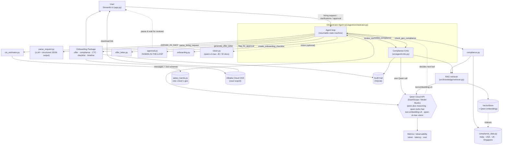

# HCM Autopilot Agent — Architecture

HCM Autopilot is an enterprise Human Capital Management agent built for Track 4. It turns an ambiguous, natural-language hiring request into a complete, compliant onboarding package: the agent decomposes the request, executes a sequenced tool pipeline through **Qwen Cloud function calling**, runs a **multi-agent Compliance-Critic** that can force an automatic revision, pauses at a **human-in-the-loop approval gate**, and only then assembles the final package (offer letter, compliance summary, CTC breakdown, onboarding checklist and timeline). The LLM is the reasoning engine that decides which tool to call next; deterministic tools — augmented by a RAG retriever over the compliance knowledge base — do the domain work, and every call is metered for token, latency and cost observability.

## System components & data flow



## Pipeline phases

| # | Phase                 | Tool                          | Nature                    |
|---|-----------------------|-------------------------------|---------------------------|
| 1 | Request Parsing       | `parse_hiring_request`        | LLM (structured output)   |
| 2 | Compliance Check      | `check_geo_compliance`        | Knowledge base + RAG      |
| 3 | CTC Estimation        | `estimate_ctc_band`           | Knowledge base            |
| 4 | Offer Draft           | `generate_offer_letter`       | Deterministic (template)  |
| 5 | Compliance Review     | `review_compliance`           | Critic (sub-agent, LLM)   |
| 6 | **Human Approval**    | `flag_for_approval`           | **HITL pause**            |
| 7 | Onboarding Checklist  | `create_onboarding_checklist` | Deterministic             |
| 8 | Complete              | —                             | Package export (OSS/audit)|

## Key design decisions

### 1. Qwen Cloud as the reasoning engine
All reasoning flows through the OpenAI SDK pointed at DashScope's compatible-mode
endpoint (`https://dashscope-intl.aliyuncs.com/compatible-mode/v1`), Alibaba
Cloud's Model Studio. `src/utils/qwen_client.py` exposes the full surface:
**function calling** (with parallel tool calls), **structured `json_object`
output** for reliable field extraction, **streaming with `include_usage`** for
live narration plus usage accounting, and **`text-embedding-v4` embeddings** for
RAG. `qwen-plus` is the primary reasoning model, `qwen-turbo` the fast/cheap
fallback, and `qwen-vl-max` handles optional vision (JD screenshots, ID docs).

### 2. Resumable orchestrator (survives Streamlit reruns)
Streamlit re-runs the whole script on each interaction, and the workflow must
pause for a human. The orchestrator is a **resumable state machine**, not a
blocking loop: `_run()` executes tool calls until it finishes, asks a clarifying
question, or hits the approval gate — then returns control. The full
conversation and collected artifacts live in session state, and resume is
**threaded on the pending `tool_call_id`** so `submit_clarification()` /
`submit_approval()` inject the human's decision as the exact tool result the
model is waiting on.

### 3. Multi-agent Compliance-Critic
`review_compliance` is a distinct agent (`src/agent/critic.py`) with its own
system prompt and its own Qwen call, surfaced to the lead agent as a tool
(multi-agent-via-tools). Deterministic guardrails (CTC-within-band checks,
pre-start Right-to-Work flags) run first and never hallucinate; the LLM critic
adds nuanced findings, and the two verdicts are merged. If it returns
`passed=false`, the orchestrator is instructed to fix the flagged issues (e.g.
re-run `estimate_ctc_band` with a cap, regenerate the offer) and re-review
**before** the human gate — a reflection loop, not a single linear pass.

### 4. Deterministic tools over hardcoded + RAG-augmented knowledge bases
Compliance and salary data live in self-contained Python knowledge bases, so
core results are stable, testable and offline-runnable. A **RAG retriever**
(`VectorStore` + Qwen embeddings) indexes the compliance KB and augments the
compliance check and the critic with semantically-retrieved statutory context,
without letting the model invent law. Only parsing and the critic call the LLM;
the rest is deterministic.

### 5. Alibaba Cloud services end-to-end
Beyond DashScope (Model Studio) for reasoning, embeddings and vision, the final
package is **exported to Alibaba Cloud OSS** via `oss2` (yielding a downloadable
artifact link), and every material step is written to a **SQLite audit trail**
for traceability.

### 6. Observability
`qwen_client` records a `CallMetrics` entry per call — prompt/completion tokens,
latency and an estimated USD cost — into a global collector the UI reads for its
token/cost/latency badges.

## Module map

```
app.py                           Streamlit UI (intake, phase tracker, expanders, HITL, download)
src/agent/orchestrator.py        Agent loop, tool schemas, artifact collection, pause/resume
src/agent/critic.py              Compliance-Critic sub-agent (review_compliance)
src/tools/parse_request.py       parse_hiring_request      (LLM + structured output)
src/tools/compliance.py          check_geo_compliance      (KB + RAG)
src/tools/ctc_estimator.py       estimate_ctc_band         (salary KB)
src/tools/offer_letter.py        generate_offer_letter     (deterministic template)
src/tools/onboarding.py          create_onboarding_checklist (sequenced tasks + timeline)
src/tools/approval.py            flag_for_approval         (HITL gate)
src/tools/vision.py              qwen-vl-max vision helper  (JD / ID document parsing)
src/knowledge/compliance_data.py Compliance KB (India/USA/UK/Singapore + states)
src/knowledge/salary_bands.py    Salary KB (role x level x geography)
src/knowledge/retriever.py       RAG retriever: VectorStore + Qwen embeddings over the compliance KB
src/utils/qwen_client.py         Qwen Cloud wrapper: chat/stream/structured/embed + metrics + fallback
src/utils/oss_client.py          Alibaba Cloud OSS export of the onboarding package (oss2)
src/utils/audit.py               SQLite audit trail of workflow steps and decisions
src/ui/theme.py                  Streamlit theming / styling helpers
```
